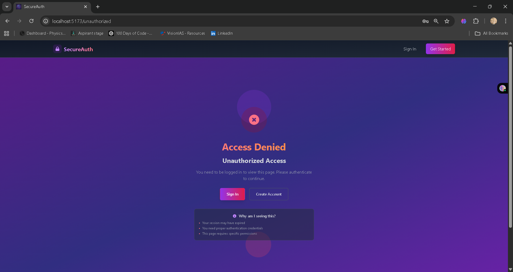

## 🔐 SecureAuth: A Modern, Full-Stack Authentication System

### Overview

SecureAuth is a comprehensive, full-stack application designed to demonstrate a robust and modern authentication architecture. It provides a secure, flexible, and developer-friendly framework that integrates traditional password-based logins with next-generation passwordless authentication using **Passkeys (WebAuthn)**.

The project is built with a **React frontend** and a **Node.js backend**, following a clean, modular structure. It’s ideal for developers looking to understand and implement a secure authentication flow that is both user-friendly and resistant to common threats like phishing and credential stuffing.

---

### ✨ Features

* **Email & Password Authentication**: A traditional login/registration flow with secure password hashing.
* **Passkey Authentication (WebAuthn)**: Enables users to register and log in with platform authenticators like Face ID, Touch ID, Windows Hello, or external security keys. This offers a seamless, passwordless experience.
* **Multi-Factor Authentication (MFA)**: Supports TOTP (Time-Based One-Time Password) for an additional layer of security, compatible with apps like Google Authenticator or Authy.
* **Backup Codes**: Provides one-time backup codes for users who lose access to their MFA device.
* **Session Management**: A dashboard for users to view and revoke active sessions across different devices.
* **Token-Based Security**: Utilizes JSON Web Tokens (JWT) for API authentication, paired with secure, HttpOnly cookies for refresh tokens.
* **Modular Architecture**: The project is structured with distinct layers for components, pages, services, and utilities, making it easy to maintain and extend.

---

### Project Structure

```sh
frontend/
├── public/
│   └── favicon.ico
│
├── src/
│   ├── assets/              # Logos, SVGs, images
│   │   └── logo.svg
│   │
│   ├── components/          # Reusable UI components
│   │   ├── forms/
│   │   │   ├── InputField.jsx
│   │   │   ├── PasswordField.jsx
│   │   │   └── Button.jsx
│   │   ├── Navbar.jsx
│   │   ├── Footer.jsx
│   │   └── ProtectedRoute.jsx
│   │
│   ├── context/             # Auth + User context
│   │   └── AuthContext.jsx
│   │
│   ├── hooks/               # Custom hooks
│   │   └── useAuth.js
│   │
│   ├── layouts/             # Page layouts
│   │   ├── AuthLayout.jsx
│   │   └── DashboardLayout.jsx
│   │
│   ├── pages/               # Application pages
│   │   ├── auth/
│   │   │   ├── Login.jsx              # Email + Password login
│   │   │   ├── Register.jsx           # Email + Password register
│   │   │   ├── VerifyEmail.jsx        # Email verification
│   │   │   ├── MFAVerify.jsx          # TOTP / backup code input
│   │   │   ├── MFASetup.jsx           # Setup TOTP (QR, secret)
│   │   │   ├── WebAuthnSetup.jsx      # Setup passkey
│   │   │   └── WebAuthnLogin.jsx      # Login using passkey
│   │   │
│   │   ├── dashboard/
│   │   │   ├── Index.jsx              # Overview / welcome
│   │   │   ├── Security.jsx           # Security settings (MFA, backup codes)
│   │   │   └── Sessions.jsx           # Active sessions list
│   │   │
│   │   ├── errors/
│   │   │   ├── NotFound.jsx
│   │   │   └── Unauthorized.jsx
│   │   │
│   │   └── Home.jsx                   # Landing page
│   │
│   ├── services/            # API calls
│   │   ├── api.js           # Axios instance
│   │   ├── auth.js          # Login, register, refresh token
│   │   ├── mfa.js           # MFA setup/verify
│   │   ├── webauthn.js      # WebAuthn API
│   │   └── user.js          # User profile, sessions
│   │
│   ├── utils/
│   │   ├── validators.js    # Form validation
│   │   └── storage.js       # LocalStorage helpers (tokens, sessions)
│   │
│   ├── App.jsx              # Main App
│   ├── index.css            # Tailwind import
│   ├── main.jsx             # ReactDOM root
│   └── routes.jsx           # All routes central definition
│
├── .env                     # API URL
├── tailwind.config.js
├── postcss.config.js
├── package.json
└── vite.config.js           # If using Vite


```

---


### 🏛️ Architecture

#### Frontend (React + Vite)
The frontend is a single-page application (SPA) built with React and Vite for a fast development experience. It's styled with **TailwindCSS** for rapid, utility-first styling.

**Key Libraries**:
* `react-router-dom`: Manages client-side routing and protected routes.
* `axios`: Handles all API communication with the backend.
* `@simplewebauthn/browser`: A helper library for interacting with the WebAuthn API, simplifying the process of creating and retrieving credentials.
* **Context API**: Manages global authentication state, making user data and auth functions available throughout the application without prop drilling.

#### Backend (Node.js + Express)
The backend is a RESTful API that handles all authentication logic, database interactions, and token management.

**Key Libraries**:
* `express`: The web framework for building the API.
* `@simplewebauthn/server`: The backend counterpart to handle WebAuthn challenges and verification.
* `jsonwebtoken`: For creating and verifying JWT access tokens.
* `otplib`: For generating and verifying TOTP codes.
* `pg`: The PostgreSQL client for database interactions.

---

### 🔑 Authentication Flow

#### Password-Based Flow
1.  **Login**: User submits email and password. The backend verifies credentials, generates a JWT access token, and sets an HttpOnly refresh token cookie.
2.  **API Calls**: The access token is sent in the `Authorization` header for all protected API calls.
3.  **Token Refresh**: When the access token expires, an Axios interceptor automatically sends a request to the backend with the refresh token cookie to get a new access token.

#### Passkey (WebAuthn) Flow
1.  **Registration**:
    * A logged-in user navigates to the Passkey Setup page.
    * The frontend requests registration options from the backend (`/webauthn/register-options`).
    * The backend generates a unique challenge and sends it to the frontend.
    * The frontend uses `navigator.credentials.create()` to prompt the user's device for a biometric scan or PIN.
    * The device generates a private key and a public key. The public key, along with a signed response, is sent to the backend (`/webauthn/register`).
    * The backend verifies the response against the original challenge and stores the public key.

2.  **Login**:
    * The user enters their email on the login page.
    * The frontend requests authentication options from the backend (`/webauthn/login-options`).
    * The backend generates a new challenge and sends a list of the user's registered credentials.
    * The frontend uses `navigator.credentials.get()` to prompt the user to authenticate with their passkey.
    * The device signs the challenge with the private key.
    * The signed response is sent to the backend (`/webauthn/login`).
    * The backend verifies the signature using the stored public key and issues JWT and refresh tokens.

---

### UI Design

* Login Page


* Register Page


* Home Page


* Dashboard


* Two Factor Auth


* BackUp Codes


* Google Authenticator Setup


* Sessions Page


* Passkey Register Auth


* Profile Page


* 404 Not Found Page


* Unauthorised Page


---
